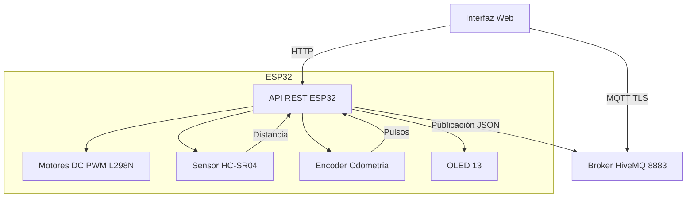
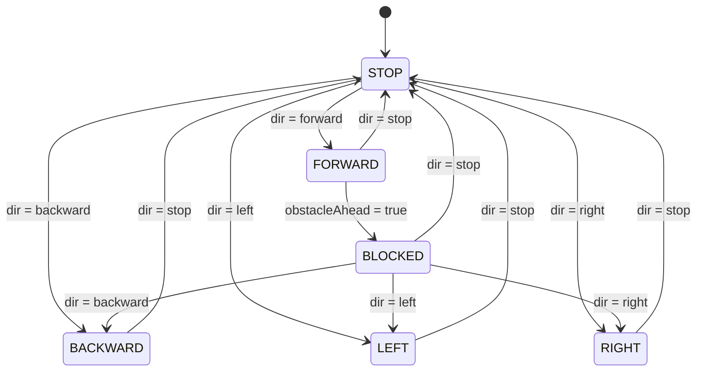
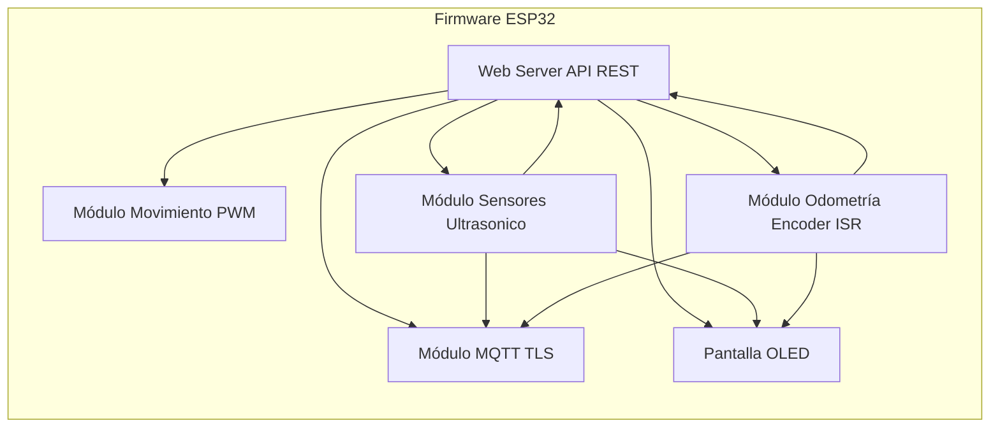
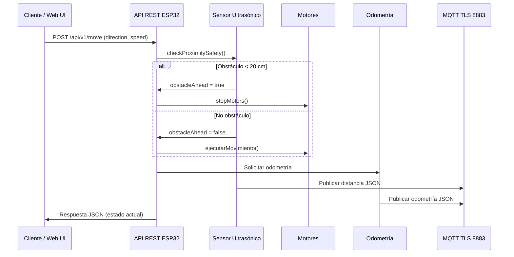

# IOT

# ESP32 Car Control – API REST + MQTT (TLS) + Sensor Ultrasónico + Odometría + Web UI

## Nicolas Rodriguez - Camilo Otalora - Juan Diego Martinez

## Descripción General

Este proyecto implementa el control remoto de un vehículo 2WD usando un ESP32 con:

* API REST v1 para control y monitoreo.
* Comunicación segura MQTT con TLS/SSL.
* Sensor ultrasónico HC-SR04 para detección de obstáculos.
* Bloqueo inteligente SOLO hacia adelante.
* Encoder para odometría (velocidad y distancia).
* Pantalla OLED SH1106 para visualizar telemetría.
* Interfaz web embebida para controlar el carro.

El sistema combina control, seguridad, telemetría y visualización en tiempo real.

---

## Características Principales

* Conexión WiFi + servidor web integrado.
* API REST v1:

  * `/api/v1/healthcheck`
  * `/api/v1/move`
* MQTT con cifrado TLS (puerto 8883) usando `WiFiClientSecure`.
* Control de motores mediante puente H (IN1–IN4, ENA/ENB) con PWM.
* Lectura de sensor ultrasónico y bloqueo de seguridad.
* Odometría con encoder y cálculo de velocidad.
* Pantalla OLED con estado en tiempo real.
* Endpoints legacy para la interfaz web.

---
## Librerías utilizadas

En este proyecto se utilizaron las siguientes librerías:

- `WiFi.h`  
  Permite conectar el ESP32 a una red WiFi en modo estación (STA) o punto de acceso (AP).

- `WiFiClientSecure.h`  
  Proporciona el cliente seguro (TLS/SSL) para establecer conexiones cifradas, por ejemplo con el broker MQTT en el puerto 8883.

- `WebServer.h`  
  Implementa un servidor web HTTP ligero en el ESP32, usado para servir la interfaz web y la API REST (`/api/v1/...`).

- `PubSubClient.h`  
  Cliente MQTT para publicar y suscribirse a tópicos. En este proyecto se utiliza sobre `WiFiClientSecure` para habilitar MQTT con TLS.

- `Wire.h`  
  Librería para comunicación I2C, utilizada principalmente para comunicar el ESP32 con la pantalla OLED.

- `Adafruit_GFX.h`  
  Librería gráfica base de Adafruit que proporciona primitivas de dibujo (texto, líneas, rectángulos, etc.) para pantallas.

- `Adafruit_SH110X.h`  
  Controlador específico para pantallas OLED basadas en el chip SH1106/SH1107. Se usa para manejar la pantalla OLED 1.3" del carro.


  ## Uso de memoria

De acuerdo al reporte del IDE de Arduino para este proyecto:

- **Memoria de programa (Flash)**  
  - Uso: **1 094 863 bytes (83%)**  
  - Máximo disponible: **1 310 720 bytes**

- **Memoria dinámica (RAM)**  
  - Variables globales: **48 024 bytes (14%)**  
  - Espacio libre para variables locales: **279 656 bytes**  
  - Máximo disponible: **327 680 bytes**

Estos valores indican que el sketch aprovecha una parte importante de la memoria de programa del ESP32, pero aún mantiene un margen cómodo tanto en Flash como en RAM para futuras extensiones o ajustes.


## Estructura del Código

* **Variables de preprocesador:** define de WiFi, MQTT, TLS, pines de motores, pines del sensor, encoder, distancias y parámetros globales.
* **Funciones de motor:** Adelante, atrás, izquierda, derecha y detener. Gestión del PWM y dirección.
* **Funciones del sensor ultrasónico:** Medición real con HC-SR04 y detección de obstáculos con distancia mínima segura.
* **Bloqueo de seguridad:** Impide avanzar cuando hay un obstáculo pero permite retroceder y girar.
* **Odometría:** Uso de interrupciones, cálculo de distancia y velocidad.
* **Pantalla OLED:** Visualización de dirección, velocidad, odometría, distancia e IP.
* **Servidor Web + API REST v1:** Control de movimiento, monitoreo y compatibilidad con interfaz gráfica.
* **MQTT TLS:** Publicación de distancia, obstáculos y odometría en formato JSON.

### **Endpoints REST:**

* `/api/v1/healthcheck`: Estado del sistema, WiFi, MQTT TLS, dirección, distancia y flags.
* `/api/v1/move`: Recibe `direction` y `speed` para ejecutar movimiento.

### **Endpoints Legacy:**

* `/move` (usado por la UI)
* `/distance`
* `/odometry`
* `/`

### **Temas MQTT:**

* `esp32/car/distance`
* `esp32/car/odometry`
* `esp32/car/emergency`
* `esp32/car/instructions` 
---

## Relación con las instrucciones del laboratorio

* Se implementó lectura de sensor ultrasónico con bloqueo solo adelante.
* Publicación periódica en MQTT de distancia y estado del obstáculo.
* Uso de define para pines, WiFi, MQTT y seguridad.
* API REST funcional con endpoints requeridos.
* Se agregó odometría con encoder como mejora adicional.
* Se añadió interfaz web embebida totalmente funcional.
* Se configuró conexión MQTT cifrada mediante TLS.

---

## Diagrama de Arquitectura (Mermaid)



---

## Ejemplo de Publicación del Sensor

```json
{
  "distance": 18.5,
  "obstacle": true
}
```

## Ejemplo de Publicación de Odometría

```json
{
  "velocity_kmh": 0.42,
  "distance_meters": 3.12
}
```

---

## Temas MQTT

* **Distancia:** `esp32/car/distance`
* **Odometría:** `esp32/car/odometry`
* **Emergencias:** `esp32/car/emergency`
* **Instrucciones :** `esp32/car/instructions`

---


## Limitaciones del Sistema

* TLS configurado como `setInsecure()` sin validación.
* No hay autenticación en API o UI.
* Solo un sensor frontal.
* MQTT usado solo para publicar.
* Control remoto requiere estar en la misma red.

---

## Posibilidades de Mejora

* Activar validación de certificado TLS (`setCACert`).
* Añadir sensores laterales y trasero.
* Panel de control externo en Node-RED o Grafana.
* Implementar autenticación (JWT / API KEY).
* Soporte para control autónomo.
* Integrar servicios IoT (AWS IoT, EMQX, Azure).
  ``

## Diagrama de Estados (Mermaid)



---

## Diagrama de Bloques del Firmware (Mermaid)



---

## Diagrama API REST (Mermaid)


